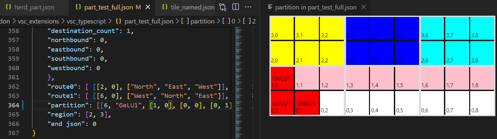
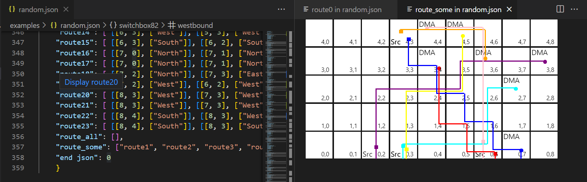

Copyright© 2022 Advanced Micro Devices, Inc.

# Placement and Routing Viewer README

This viewing extension can be used for viewing placed herds and / or routed herds. Files must be in .json format, as output by ```aie-translate -aie-flows-to-json``` or ```air-translate -air-herds-to-json```.

## Getting Started

### Prerequisites

```npm 9.1.3``` or newer \
```node v14``` or newer \
```vsce 2.15``` or newer

### Instructions

1. Open this folder in vscode
2. Run ```npm install```
3. Build the package with ```vsce package```
4. Copy or move the .vsix file to your VSCode extensions folder on your local machine: ```.vscode/extensions```. Depending on your platform, it is located in the following folders: \
Windows: ```%USERPROFILE%.vscode\extensions``` \
macOS: ```~/.vscode/extensions``` \
Linux: ```~/.vscode/extensions``` or ```~/.vscode-server/extensions```
5. In the extensions folder, run ```code --install-extension prviewer-1.0.0.vsix```
6. The commands should be available for use. You may need to enable the extension if connected to a server (connect to server -> open extensions tab -> under 'local - installed' find prviewer and install on server).

## Commands

To run the commands, press ctrl + shift + p, ensure the line starts with a ">", and type the command of your choice into the searchbar. A command will need to be run before hovering works.

The current commands are ```Placement View: Open Placement Webview``` and ```Routing View: Open Routing Webview```.

Note that the size of the grid is determined by the largest row and column values of the switchboxes.

### 1. Placement Viewer

Placement View: Open Placement Webview

Shows a webview visualization of the placement field on the active file window. The file format must be ".json". The webview updates each time the .json file is saved, each time the ctrl + shift + p command is run, and each time the segment is clicked in the .json file.



The segment field must be formatted in either of the the following ways: \
``` "segment": [[<herd #>, [AIE_Row, AIE_col] ...] ...] ``` \ or \
``` "segment": [[<herd #>, "<herd>", [AIE_Row, AIE_col] ...] ...] ```  \
part_test_full.json provides an example file.

Note that the white blocks represent those tiles that are not in a herd. The colors of specific herds can be changed by changing the herd number. Note that there are only 128 colors available - if this number is exceeded, the colors will repeat.


There is an optional "region" field that can be included in the .json file to help visualize regions. the region field is in the form \
```"region": [<#rows included in region>, <#cols included in region>] ``` \

### 2. Routing Viewer

Routing View: Open Route Webview

Shows a webview visualization of the routing field on the active file window.



The routing field must be formatted in the following way: \
``` "route<xx>": [ [ [<AIE_col #>, <AIE_Row #>], ["<direction or DMA>", ...] ], ... [] ]  ``` \
Where xx is the route number. part_test_full.json provides an example file. 

Multiple routes can be displayed at a single time in different windows. To open up a 2nd route, just hover over the name of the route you wish to display and click the link. Clicking the link again will update that route view. Saving will update all route views from a given file.

### Keywords

In order to view all of the routes given in a file, add the following route to the file:
```"route_all": []```

To view a subset of the routes, use the keyword "route_some":
```"route_some<identifier>": [<route name>, ...] ```

Unfortunately, there is no easy way to view the names of individual routes (e.g., by hovering). However, as the first entry in each route is the source, it can be easily be found by looking at the webview, finding the tile containing the "source" keyword that has a colored square at the edge of a route, and looking for that tile in the first entry of each route. Circles represent DMAs.

## Modifying

In order to run in debug mode, do the following:

1. Open this folder in vscode
2. Run ```npm install```
3. Navigate to the Run and Debug menu, select "Run Extension" from the dropdown menu, and click run

The commands should be available in the ctrl + shift + p menu that appears. The viewer extension.js file contains the source code for the viewer.

## Known Issues

1. Opening and closing a window too many times may produce a panel dispose error. If this persists, either close all of the .json and webview panels, or restart VSCode.
